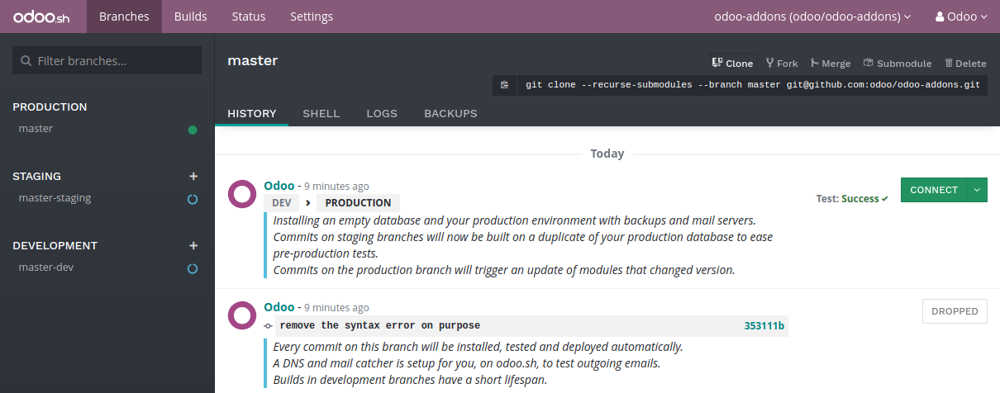

:banner: banners/odoo-sh.jpg

==================================
Builds
==================================

Overview
========

In Odoo.sh, a build is considered as a database loaded by an Odoo server
(`odoo/odoo <https://github.com/odoo/odoo>`_ & `odoo/enterprise <https://github.com/odoo/enterprise>`_)
running on a specific revision of your project repository.
Its purpose is to test the well-behavior of the server, the database and the features with this revision.

Most of the time, builds are created following pushes on your Github repository.
They can be created as well when you do other operations,
such as importing a database on Odoo.sh or asking a rebuild for a branch in your project.

A build is considered successful if no errors or warnings come up during its creation.
A successful build is highlighted in green.

A build is considered failed if errors come up during its creation.
A failed build is highlighted in red.

If warnings come up during the creation, but there are no errors, the build is considered almost successful.
It is highlighted in yellow to notify the developer warnings were raised.

Builds do not always create a database from scratch.
For instance, when pushing a change on the production branch, the build which is created just starts the server
with your new revision and tries to load the current production database on it.
If no errors come up, the build is considered successful, and otherwise failed.

Production
==========

The first build of a production branch creates a database from scratch.
If this build is successful, this database is considered as the production database of your project.

From then, pushes on the production branch will create new builds that attempt to load the database
using a server running with the new revision.

If the build is successful, or has warnings but no errors, the production database will now run with this build, along
with the revision associated to this build.

If the build fails to load or update the database, then the previous successful build is re-used to load the database,
and therefore the database will run again using a server running with the previous successful revision.

The build used to run the production database is always the first of the builds list. If a build fails, it is
put after the build currently running the production database.

Staging
=======

Staging builds duplicate the production database,
and try to load this duplicate with the revisions of the staging branches.

Each time you push a new revision on a staging branch, the build created uses a new copy of the production database.
The databases are not re-used between builds of the same branch. This ensures:
* staging builds use databases that are closed to what the production looks like,
so you do not make your tests with outdated data,
* you can play around as much as you want in the same staging database,
and you can then ask for a rebuild when you want to restart from a new copy of the production.

Nevertheless, this means that if you make configuration changes in staging databases
and do not apply them in the production,
they will not be passed on the next build of the same staging branch.

Development
===========

Development builds create new databases, load the demo data and run the unit tests.
